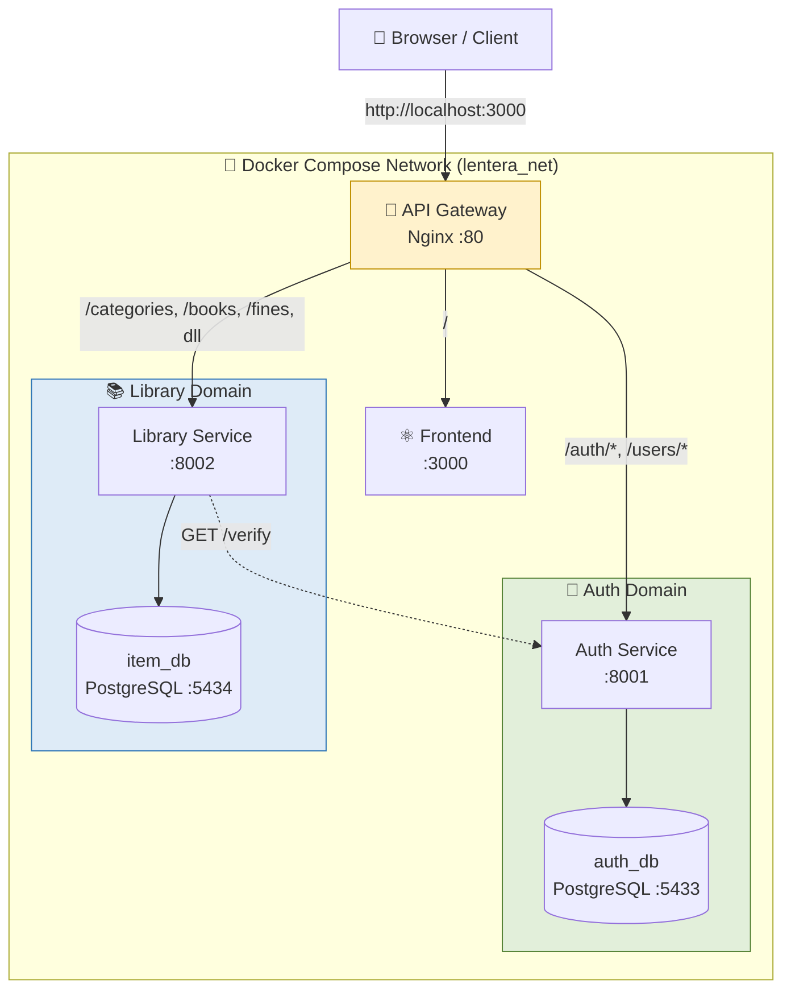

# 🏛️ Arsitektur Microservices - LenteraPustaka

Dokumen ini menjelaskan spesifikasi dan cetak biru arsitektur baru untuk aplikasi LenteraPustaka (Kelompok A - Hexacore) setelah dilakukan dekomposisi dari arsitektur Monolith menjadi Microservices.

## 1. Diagram Arsitektur (Mermaid)



## 2. Daftar Services & Alokasi Port

Dalam lingkungan pengembangan lokal menggunakan Docker Compose, sistem ini dipecah menjadi 6 kontainer independen yang saling terhubung dalam jaringan `lentera_net`:

| Nama Container | Service Type | Port Host | Port Container | Data Volume / Static Files | Deskripsi |
| :--- | :--- | :---: | :---: | :--- | :--- |
| **lentera-gateway** | Nginx Proxy | `80` | `80` | - | Pintu masuk tunggal yang melakukan routing request. |
| **lentera-frontend** | React SPA | `3000` | `80` | - | Antarmuka pengguna (UI) LenteraPustaka. |
| **lentera-auth-service** | FastAPI | `8001` | `8001` | - | Menangani registrasi, profil, manajemen user, dan token. |
| **lentera-library-service** | FastAPI | `8002` | `8002` | `./static` (Covers & Fines) | Menangani operasi inventaris, transaksi peminjaman, dan denda. |
| **lentera-auth-db** | PostgreSQL 16 | `5433` | `5432` | `lentera-auth-pgdata` | Database terisolasi khusus data kredensial pengguna. |
| **lentera-item-db** | PostgreSQL 16 | `5434` | `5432` | `lentera-item-pgdata` | Database terisolasi khusus data inventaris, transaksi, dan denda. |

## 3. Kontrak API (API Contract)

### 🔐 Auth Service (`http://localhost/auth`, `http://localhost/users`)
* **Sistem & Tim:** `GET /health`, `GET /team`
* **Autentikasi & Profil (Member/Umum):**
  * `POST /auth/register`: Registrasi pengguna baru.
  * `POST /auth/login`: Autentikasi dan pengembalian token JWT.
  * `GET /auth/me`: Mengambil data profil user yang sedang login.
  * `PUT /auth/me/change-password`: Member mengubah password (butuh verifikasi password lama).
  * `PUT /auth/me/profile`: Mengubah nama lengkap user aktif.
* **Internal (Inter-Service):**
  * `GET /verify`: Digunakan oleh `library-service` untuk verifikasi hak akses pengguna via HTTP.
* **Manajemen User (Hanya Admin):**
  * `GET /users` | `GET /users/{id}`
  * `PUT /users/{id}` | `DELETE /users/{id}`
  * `PUT /users/{id}/reset-password`: Admin mereset paksa password spesifik user.

### 📚 Library Service (`http://localhost/categories`, `/books`, dll)
*Catatan: Mayoritas operasi di bawah memerlukan header `Authorization: Bearer <token>`.*

* **Buku, Kategori & Genre (Books & Categories):**
  * `GET /categories` | `POST /categories` | `PUT /categories/{id}` | `DELETE /categories/{id}`
  * `GET /genres` | `POST /genres` | `PUT /genres/{id}` | `DELETE /genres/{id}`
  * `GET /books` | `POST /books` | `PUT /books/{id}` | `DELETE /books/{id}`
  * `GET /books/stats`: Mengambil statistik inventaris buku.

* **Transaksi Peminjaman (Transactions):**
  * `GET /transactions` | `POST /transactions` (Pengajuan Peminjaman)
  * `GET /transactions/{id}`
  * `PUT /transactions/{id}/approve` | `PUT /transactions/{id}/reject` (Verifikasi Admin)
  * `PUT /transactions/{id}/return` | `POST /transactions/{id}/lost` (Pengembalian / Laporan Hilang)
  * `POST /transactions/{id}/simulate-overdue`: Endpoint khusus testing untuk simulasi telat pengembalian.

* **Denda (Fines):**
  * `GET /fines`
  * `POST /fines/{id}/submit-payment`: Member mengirim bukti bayar denda.
  * `PUT /fines/{id}/approve` | `PUT /fines/{id}/reject`: Admin memverifikasi atau menolak bukti pembayaran.
  * `GET /fines/stats`: Statistik komprehensif mengenai denda.
  * `GET /items/stats`: *(Alias Modul 12)* Statistik denda/item termahal dan termurah.

* **Unggahan Media (Uploads):**
  * `POST /upload/covers`: Mengunggah gambar cover buku.
  * `POST /upload/fines`: Mengunggah gambar bukti transfer pembayaran denda.

## 4. Panduan Menjalankan Sistem Secara Lokal

1. Pastikan Docker Desktop berjalan.
2. Buka terminal di direktori root proyek dan eksekusi:
   ```bash
   docker compose up --build -d
   ```
3. Lakukan verifikasi untuk memastikan seluruh kontainer berjalan stabil:
   ```bash
   docker compose ps
   ```
4. Buka browser di `http://localhost:3000` untuk antarmuka pengguna (Frontend). API beroperasi di `http://localhost`.

## 5. Prosedur Pelacakan Masalah (Debugging)

Apabila terjadi kendala, lakukan pelacakan log secara presisi berdasarkan nama kontainer:
* **Gateway:** `docker logs -f lentera-gateway`
* **Auth Service:** `docker logs -f lentera-auth-service`
* **Library Service:** `docker logs -f lentera-library-service`
* **Database:** `docker logs -f lentera-auth-db lentera-item-db`
*(Gunakan Ctrl + C untuk keluar dari mode pantauan log).*