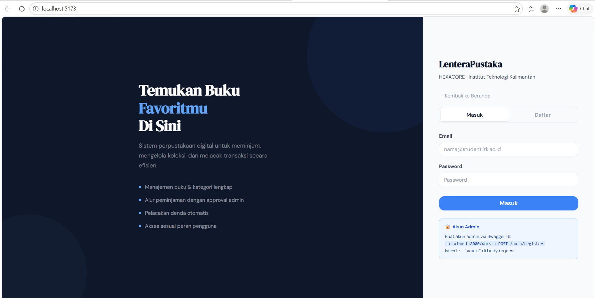
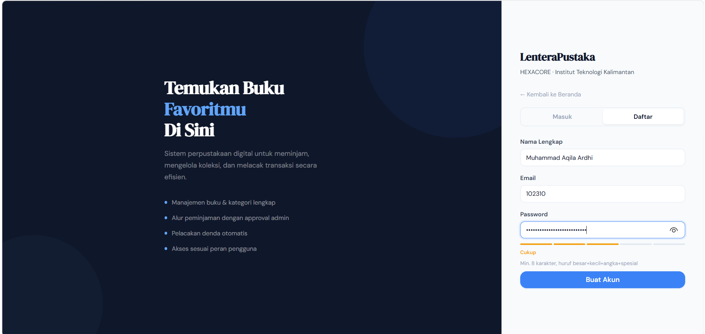
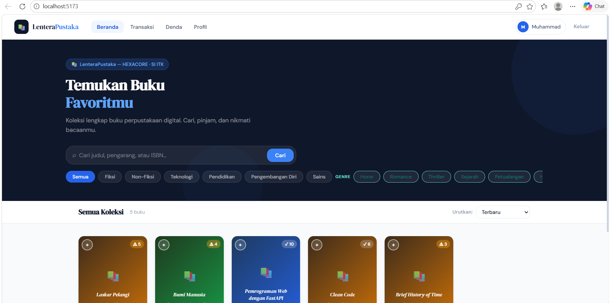
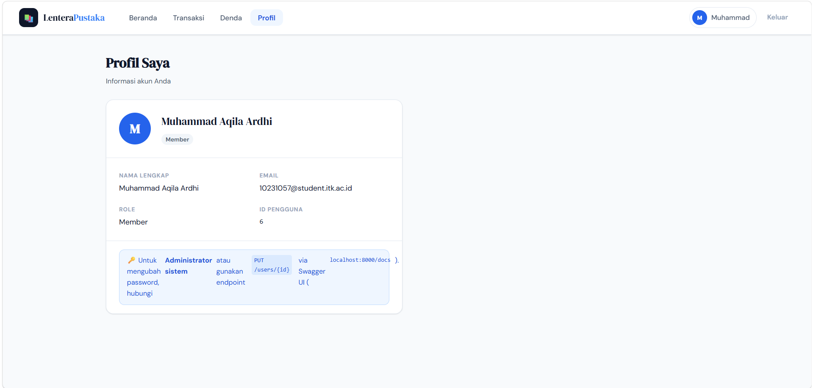
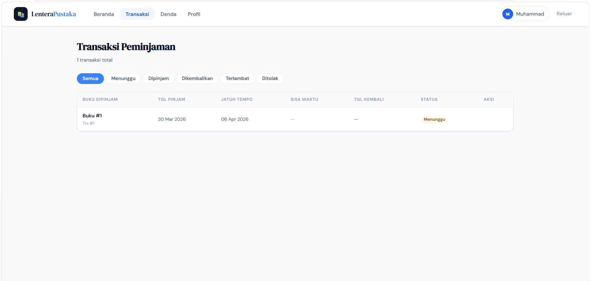
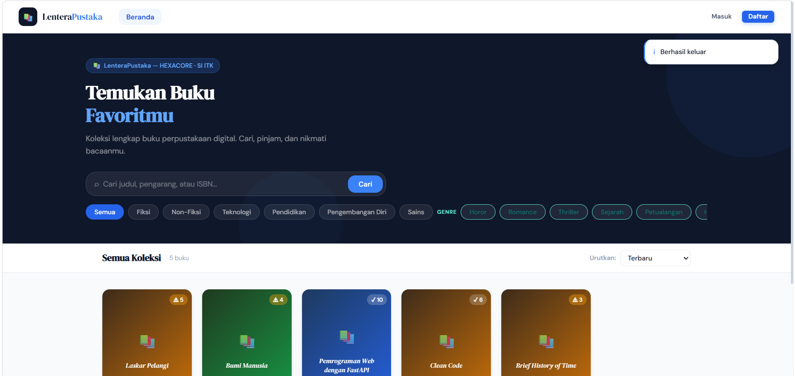
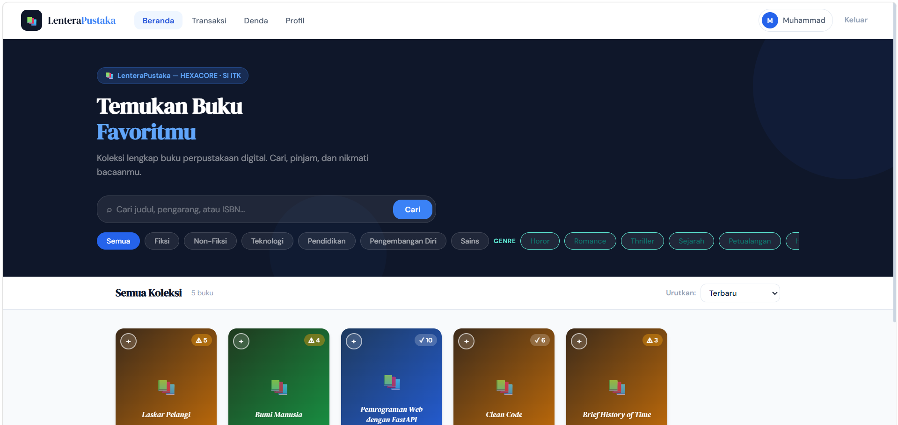
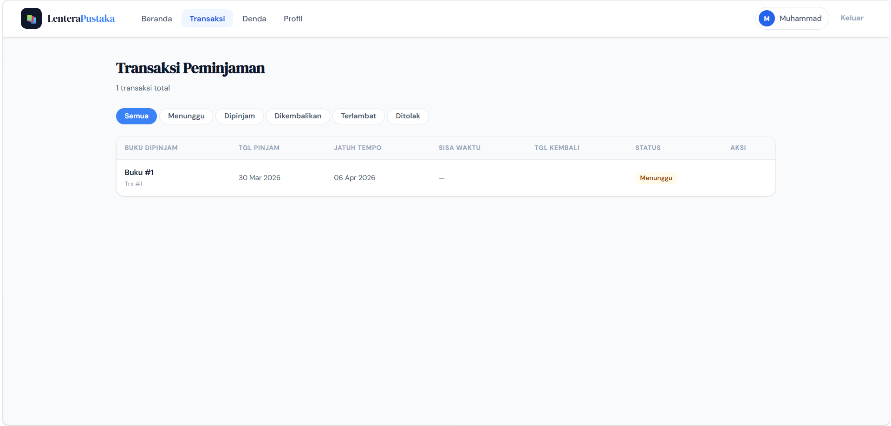

# Laporan Pengujian E2E (Autentikasi) - Modul 4

Berikut adalah dokumentasi hasil pengujian fitur Autentikasi dan Otorisasi (JWT) yang telah dilakukan pada sistem. Seluruh *test case* utama berjalan dengan sukses.

| ID Test | Deskripsi Pengujian | Hasil | Dokumentasi |
| :--- | :--- | :---: | :--- |
| **TC-AUTH-01** | Verifikasi proteksi Halaman Login | ✅ Berhasil |  |
| **TC-AUTH-02** | Proses Registrasi User Baru | ✅ Berhasil |  |
| **TC-AUTH-04** | Verifikasi Auto-Login Dashboard | ✅ Berhasil |  |
| **TC-AUTH-05** | Verifikasi Header & Info User | ✅ Berhasil |  |
| **TC-AUTH-06** | Uji Operasi CRUD (Pinjam Buku) | ✅ Berhasil |  |
| **TC-AUTH-07** | Terminasi Sesi (Proses Logout) | ✅ Berhasil |  |
| **TC-AUTH-09** | Validasi Akses (Login Ulang) | ✅ Berhasil |  |
| **TC-AUTH-10** | Verifikasi Persistensi Data | ✅ Berhasil |  |