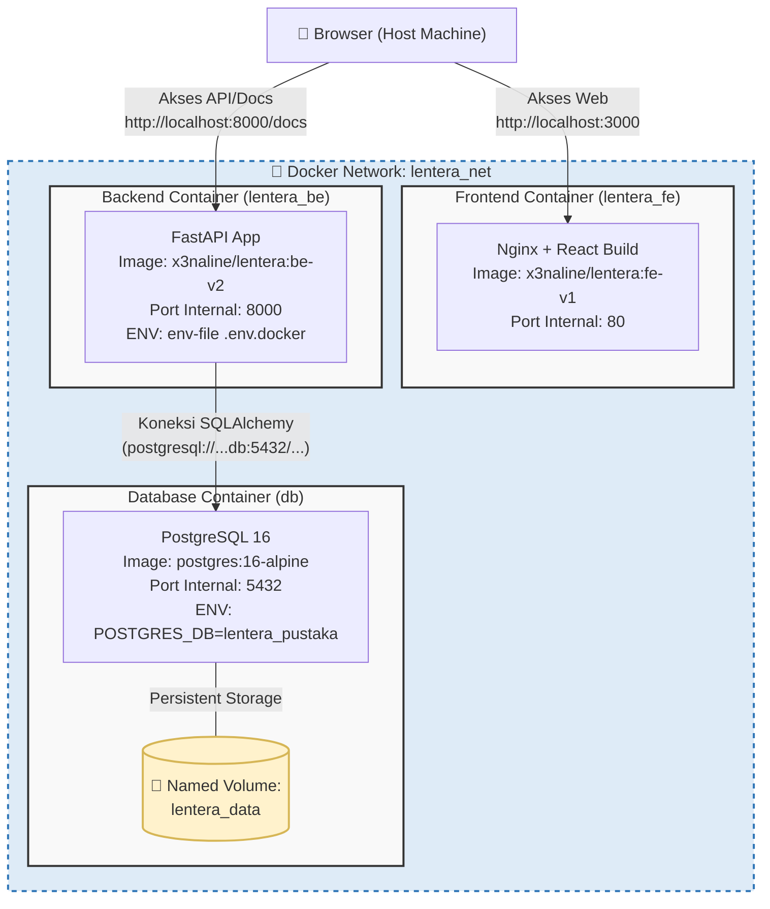

# Arsitektur Docker Multi-Container LenteraPustaka

Berikut adalah diagram arsitektur yang mendeskripsikan bagaimana sistem LenteraPustaka diisolasi dan saling terhubung menggunakan Docker. Seluruh *container* ini berjalan di atas jaringan internal yang sama (`lentera_net`) sehingga dapat saling berkomunikasi secara langsung.

