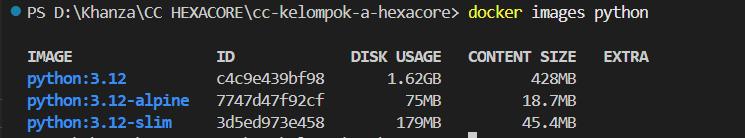

# Perbandingan Ukuran Base Image Python
Dokumen ini berisikan perbedaan ukuran `python:3.12`, `python:3.12-slim` dan `python:3.12-alpine` 

## 1. Tarik Bahan Percobaan (Pulling)
Buka terminal/PowerShell, lalu jalankan perintah ini satu per satu.
```bash
docker pull python:3.12
docker pull python:3.12-slim
docker pull python:3.12-alpine
```

## 2. Lihat Hasil Ukurannya
Setelah selesai download, ketik:
```bash
docker images python
```

## 3. Tabel hasil perbandingan


## 4. Hasil Analisis
### 1. Efisiensi Penyimpanan:
- Image python:3.12 (Full) memiliki ukuran 21x lebih besar dibandingkan versi Alpine. Ini sangat boros untuk storage server dan memperlambat proses upload/download saat deployment.
- Image python:3.12-slim berhasil memangkas ukuran hingga ~90% dari versi Full tanpa menghilangkan stabilitas sistem berbasis Debian.

### 2. Kecepatan Deployment:
- Semakin kecil Content Size (seperti `Alpine` yang cuma 18MB), semakin cepat proses CI/CD. **Namun**, Alpine memiliki risiko pada library yang butuh kompilasi C (seperti beberapa library data science).

### 3. Keamanan & Stabilitas:
- `slim` dipilih karena memiliki attack surface (celah keamanan) yang lebih kecil dibanding versi Full (karena tool yang tidak perlu dihapus), namun tetap memiliki kompatibilitas tinggi untuk library PostgreSQL yang kita gunakan.

**Singkatnya,** Kami memilih `python:3.12-slim` karena meskipun alpine lebih kecil, slim menggunakan Debian-based yang lebih stabil untuk library database kita (PostgreSQL). Full image terlalu boros storage (1.6GB+) padahal kita hanya butuh menjalankan FastAPI