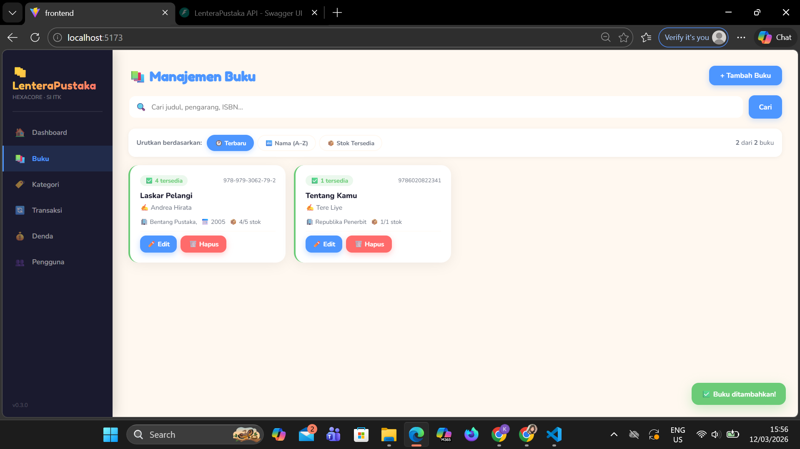
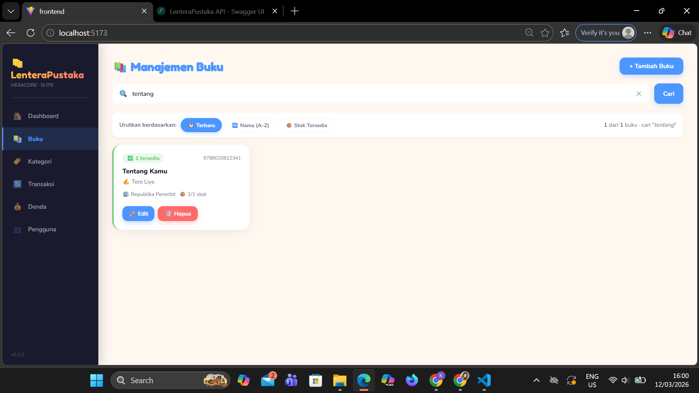
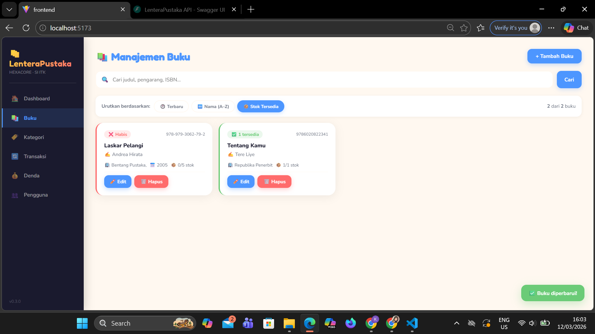
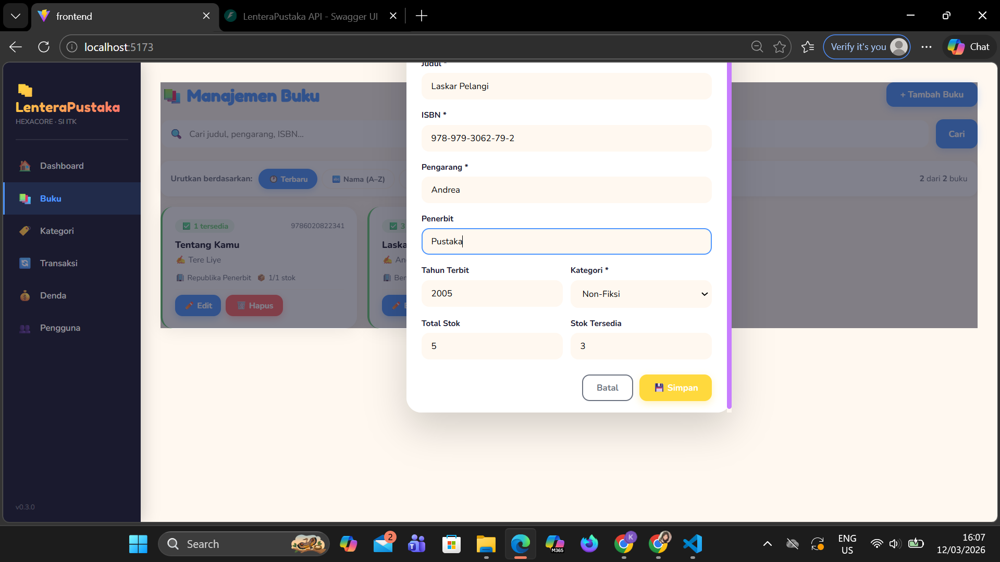
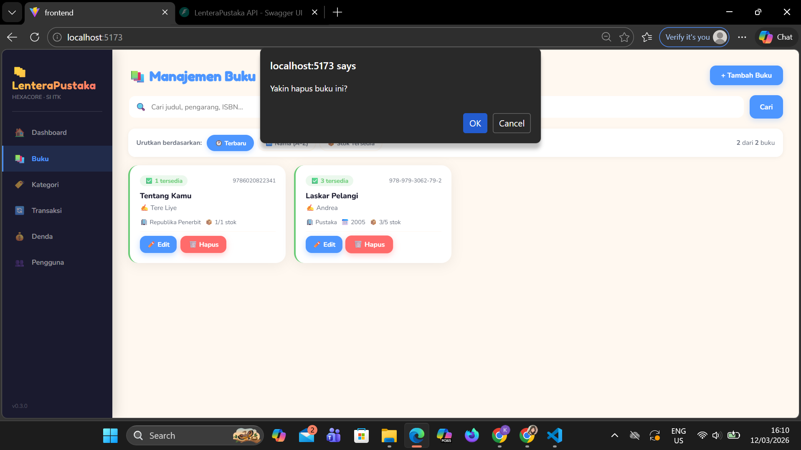
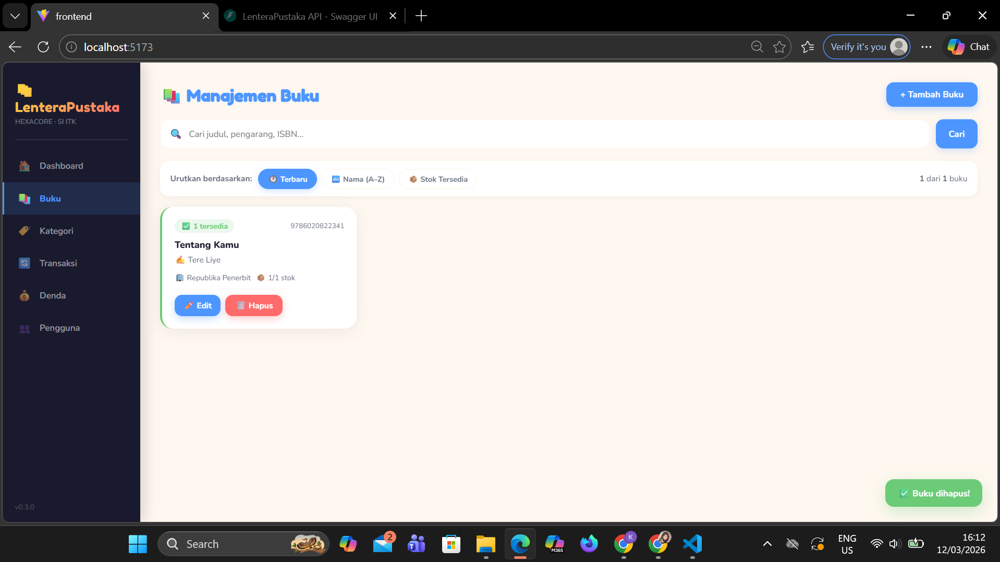

# 🧪 UI Test Results - LenteraPustaka API

Berikut ini adalah dokumentasi 10 Test Case dari LenteraPustaka

### TC-01: Initial State (Dashboard)
Akses halaman utama (Root URL). Frontend terhubung ke Backend. Gambar menunjukkan indikator "API Connected" aktif di pojok kirr atas di header.

### TC-02: Add Book
Masuk ke form tambah buku, isi detail (judul, author, isbn, kategori), dan klik Simpan.

### TC-03: GET /books
Setelah melakukan penambahan atau perubahan data UI akan menampilkan list buku terbaru yang sudah di tambahkan atau di edit. 

### TC-04: Search Feature
Ketik judul buku tertentu pada kolom Search Bar. Maka UI melakukan filter secara real-time dan hanya menampilkan buku yang relevan.

### TC-05: Sorting Feature
Klik filter yang tersedia, misalnya 'Stock Tersedia' maka UI akan buku apa yang tersedia dan tidak sesuai dengan parameter yang dipilih.

### TC-06: Edit Book
Klik tombol Edit pada buku, ubah nilai "Penerbit" atau "Stok", lalu Simpan, maka UI akan terupdate sesuai dengan perubahan yang dilakukan.

### TC-07: Delete Validation (Konfirmasi)
Klik ikon/tombol hapus pada salah satu buku. Maka muncul dialog konfirmasi (Pop-up/Modal) untuk mencegah penghapusan yang tidak disengaja.

### TC-08: Delete Action
Konfirmasi penghapusan pada dialog konfirmasi. Maka data buku hilang dari daftar UI dan terhapus secara permanen di database.

### TC-09: Notification System (Toast)
Melakukan aksi (Simpan/Hapus/Update). Muncul komponen Toast (Notifikasi) di pojok kanan bawah sebagai feedback dan hilang otomatis setelah 3 detik.

### TC-10: -

